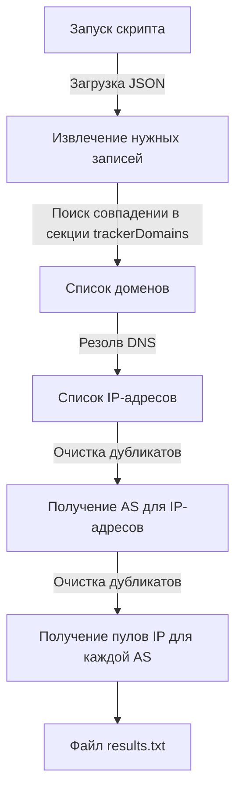

# infotecs_TI_automation
Этот проект включает в себя разработку автоматизированного решения по обработке множества PCAP-файлов захвата траффика с помощью привлечения Threat Intelligence. За основу взяты open-source фреймворки Zeek и RITA. 

Целью данного проекта является автоматизированные:
1. Обработка PCAP-файлов, поступающих в рабочую директорию.
2. Анализ файлов с помощью фреймворка [Zeek](https://github.com/zeek/zeek) и генерация отчетов.
3. Формирование белого списка доменов при помощи репозитория [AdGuard](https://github.com/AdguardTeam/AdGuardHome/blob/master/client/src/helpers/trackers/trackers.json)..
4. Построение отчетов в виде веб-страниц с помощью фреймворка [RITA](https://github.com/activecm/rita/tree/master).
5. Отдача отчетов через веб-сервер NGINX. 

## Описание this_script.sh

## Описание main.py

Cкрипт main.py генерирует белый список доменов на базе репозитория [AdGuard](https://github.com/AdguardTeam/AdGuardHome/blob/master/client/src/helpers/trackers/trackers.json).

### Структурная схема

Необходимый тип записей определяется в [данной строке](https://github.com/wellafl3x/infotecs_TI_automation/blob/main/main.py#L20) в соответствии с секцией [trackers](https://github.com/AdguardTeam/AdGuardHome/blob/master/client/src/helpers/trackers/trackers.json#L3).
