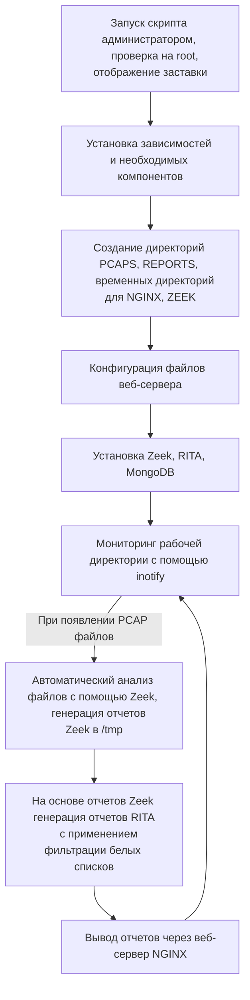
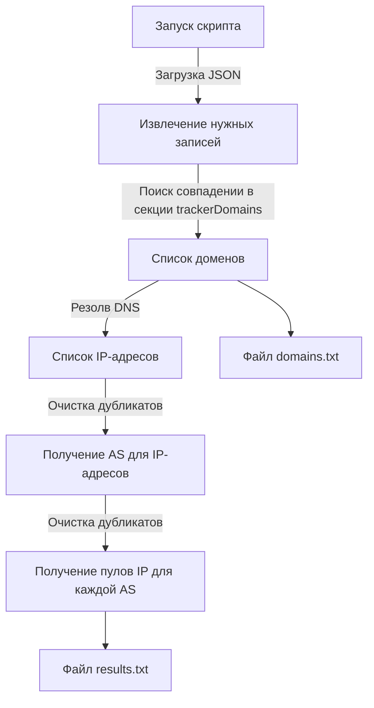

# infotecs_TI_automation

Этот проект включает в себя разработку автоматизированного решения по обработке множества PCAP-файлов захвата траффика с помощью привлечения Threat Intelligence. За основу взяты open-source фреймворки Zeek и RITA. 

Целью данного проекта является автоматизированные:
1. Обработка PCAP-файлов, поступающих в рабочую директорию.
2. Анализ файлов с помощью фреймворка [Zeek](https://github.com/zeek/zeek) и генерация отчетов.
3. Формирование белого списка доменов при помощи репозитория [AdGuard](https://github.com/AdguardTeam/AdGuardHome/blob/master/client/src/helpers/trackers/trackers.json)..
4. Построение отчетов в виде веб-страниц с помощью фреймворка [RITA](https://github.com/activecm/rita/tree/master).
5. Отдача отчетов через веб-сервер NGINX. 
## Описание this_script.sh

Скрипт this_script.sh аггрегирует весь процесс по установке и настройке необходимых компонентов, а также автоматизированный анализ дампов траффика и генерации отчетов в виде веб-страниц.

### Использование

Работа проекта протестирована на Kali Linux и разрабатывалась именно под этот дистрибутив. Временно работа скрипта возможно только из под root.

Для работы скрипта:

```
git clone https://github.com/wellafl3x/infotecs_TI_automation.git
cd infotecs_TI_automation
chmod +x ./this_script.sh
PATH_TO=/home/user/Documents WHITELIST=/home/user/whitelist.txt ./this_script.sh
```

Переменные PATH_TO и WHITELIST служат для обозначения рабочей директории и указания на файл с белым списком доменов и IP-адресов.

Доступные флаги:

 -h --help          — Отображает справку.
 --disable-zeek     — Отключает автоматическую установку Zeek
 --disable-rita     — Отключает автоматическую установку RITA
 --disable-mongo    — Отключает автоматическую установку MongoDB
 --disable-all      — Отключает автоматическую установку всех компонентов

После запуска, создаются директории PCAPS и REPORTS, согласно определенной переменной PATH_TO. При успешном выполнении подготовительных инструкций скрипт будет выполнять мониторинг директории PCAPS, куда необходимо помещать дампы траффика для анализа. При перемещении туда файлов, они автоматически будут анализироваться, а затем перемещаться по пути REPORTS/pcaps. В папке REPORTS будут находится отчеты по каждому файлу. Также, эти отчеты будут представлены через веб-сервер NGINX и доступны при обращении по 80 порту.

### Структурная схема


При наличии определенных флагов некоторые из описанных этапов могут быть пропущены.

## Описание main.py

Cкрипт main.py генерирует белый список доменов на базе репозитория [AdGuard](https://github.com/AdguardTeam/AdGuardHome/blob/master/client/src/helpers/trackers/trackers.json).

### Структурная схема


Необходимый тип записей определяется в [данной строке](https://github.com/wellafl3x/infotecs_TI_automation/blob/main/main.py#L20) в соответствии с секцией [trackers](https://github.com/AdguardTeam/AdGuardHome/blob/master/client/src/helpers/trackers/trackers.json#L3).
