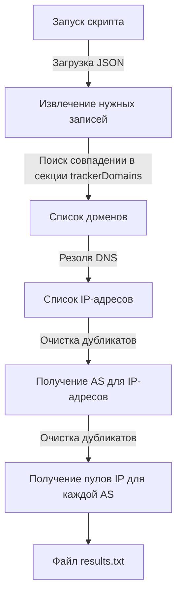

# infotecs_script
Script for automation analyze of network traffic and detect C2 exploitation with Zeek and RITA framework

# Описание

Cкрипт main.py генерирует белый список доменов на базе репозитория [AdGuard](https://github.com/AdguardTeam/AdGuardHome/blob/master/client/src/helpers/trackers/trackers.json).

# Структурная схема

Необходимый тип записей определяется в [данной строке](https://github.com/wellafl3x/infotecs_TI_automation/blob/main/main.py#L20) в соответствии с секцией [trackers](https://github.com/AdguardTeam/AdGuardHome/blob/master/client/src/helpers/trackers/trackers.json#L3).
